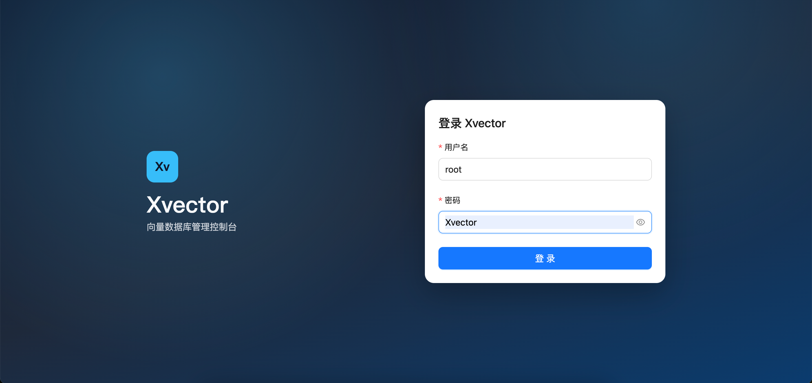
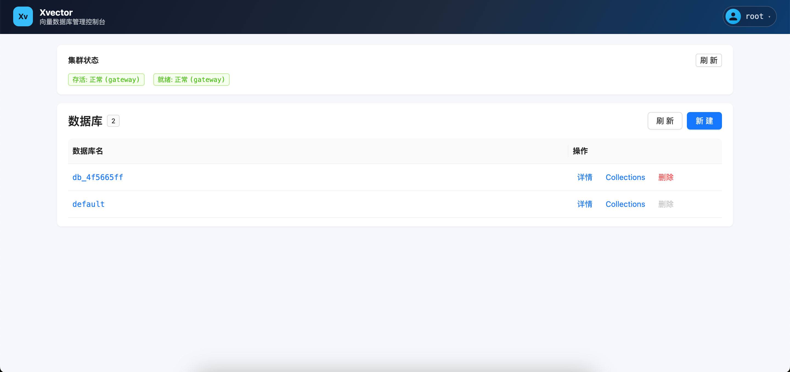
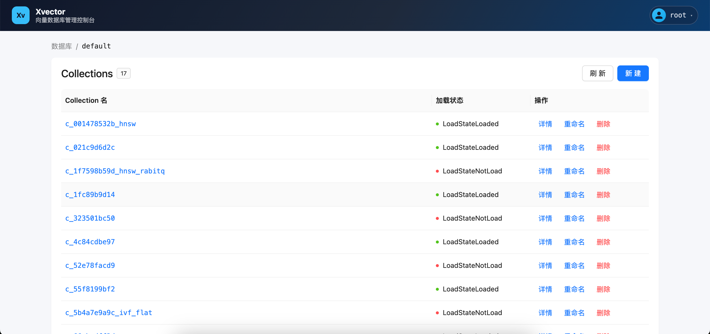
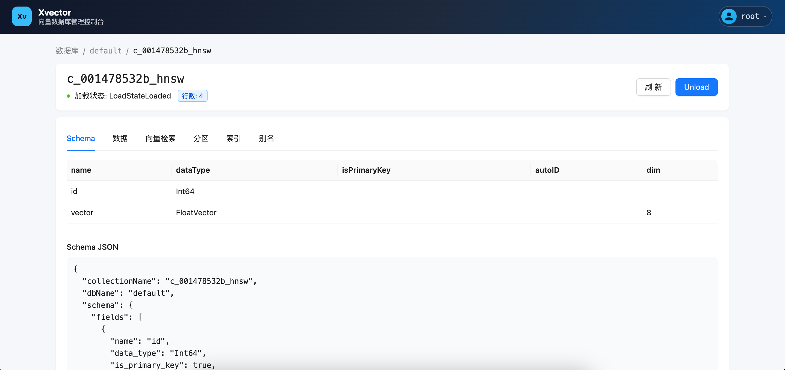
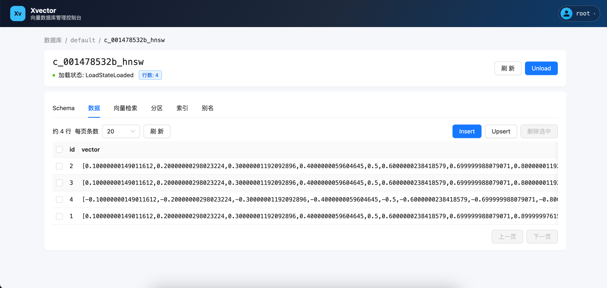
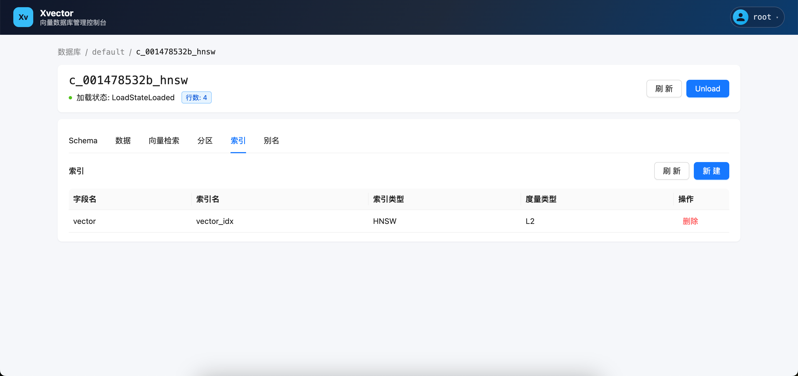
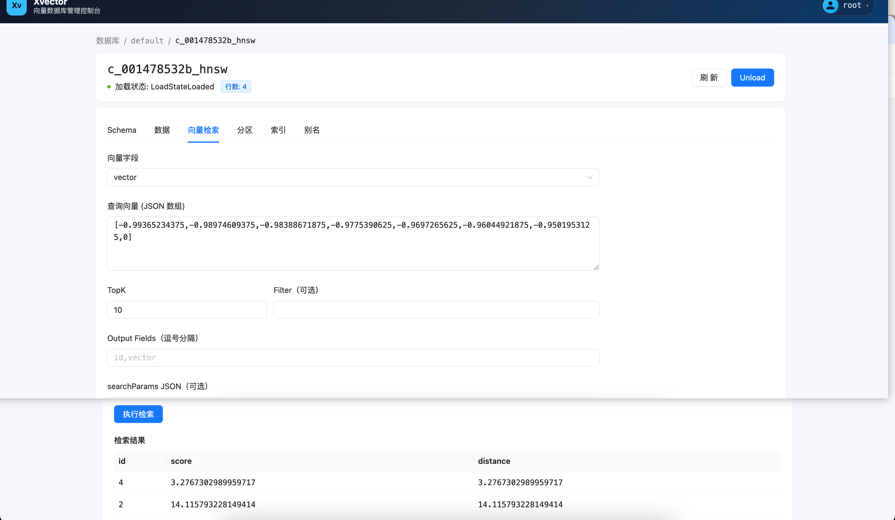

<div align="center">
  <picture>
    <source media="(prefers-color-scheme: dark)" srcset="docs/images/xvector_logo_dark.svg" />
    
  </picture>
</div>

<p align="center">
  <strong>基于 zvec 的向量库 HTTP 服务</strong><br/>
  API 对齐 Milvus REST v2 · Gateway / Writer / Reader · 管理控制台
</p>

<p align="center">
  <a href="LICENSE"></a>
  <a href="https://github.com/alibaba/zvec"></a>
  <a href="https://www.python.org/"></a>
  <a href="docker-compose.yaml"></a>
  <a href="https://fastapi.tiangolo.com/"></a>
  <a href="xvector_web/"></a>
</p>

<p align="center">
  <a href="#快速启动">🚀 <strong>快速开始</strong></a> |
  <a href="docs/DESIGN.md">📚 <strong>设计文档</strong></a> |
  <a href="#api-文档gateway-docs">🔎 <strong>API Docs</strong></a> |
  <a href="#管理控制台xvector_web">🖥️ <strong>控制台</strong></a> |
  <a href="https://github.com/alibaba/zvec">⚡ <strong>zvec</strong></a>
</p>

---

基于 [zvec](https://github.com/alibaba/zvec) 0.6.0 的向量库 HTTP 服务，API 风格对齐 **Milvus REST v2**（`/v2/vectordb/...`）。

Docker Compose 一键启动 **4 个服务**：

| 服务 | 端口 | 职责 |
|------|------|------|
| **Gateway** | **19530**（对外） | 鉴权、路由转发、合并 OpenAPI `/docs`、健康聚合 |
| **Writer** | 18081（内网） | 写 / DDL / Import / User / Role |
| **Reader** | 18082（内网） | 读 / Search / Query / Describe |
| **xvector_web** | **19531**（对外） | Vue 管理控制台（Nginx 反代 `/api` → Gateway） |

设计契约见 [`docs/DESIGN.md`](docs/DESIGN.md)。

## 架构速览

```text
Client / pyxvector / Swagger UI
        |  HTTP :19530
        v
     Gateway  ----写/DDL----> Writer:18081
        |------读/Search----> Reader:18082

Browser  --HTTP:19531-->  xvector_web (Nginx)
                             └─ /api/*  →  Gateway:19530

共享数据盘: 宿主机 ${XVECTOR_HOST_DATA_DIR:-./data}  ↔  容器 /data
```

## 快速启动

```bash
cp .env.example .env
# 编辑 XVECTOR_USERNAME / XVECTOR_PASSWORD（默认 root / Xvector）
# 可选：改 XVECTOR_HOST_DATA_DIR（默认 ./data）

docker compose up -d --build
./scripts/wait_ready.sh http://127.0.0.1:19530/readyz
```

启动后常用入口：

| 入口 | URL |
|------|-----|
| 健康检查 | `http://{host}:19530/healthz`、`/readyz` |
| **API 文档（Swagger）** | `http://{host}:19530/docs` |
| OpenAPI JSON | `http://{host}:19530/openapi.json` |
| 管理控制台登录 | `http://{host}:19531/login` |

鉴权：`Authorization: Bearer ${USERNAME}:${PASSWORD}`（密码中的 `:` 仅按第一个冒号分割）。

## API 文档（Gateway `/docs`）

Gateway 默认开启 Swagger UI（`XVECTOR_DOCS_ENABLED=true`），并定时合并 Writer / Reader 的 OpenAPI，因此在 **一个页面**即可浏览与调试全部对外接口：

```text
http://{gateway_api_host}:19530/docs
```

说明：

- Tag 按角色/资源分组，例如 `Gateway / System`、`Writer / Collection`、`Reader / Vector`。
- 右上角 **Authorize** 填入 `Bearer root:Xvector`（或你的账号）后可直接试调。
- 响应 JSON 含 `requestId`，请求/响应头统一 `X-Request-Id`，便于串 Gateway→Writer/Reader 日志。
- Writer / Reader 默认关闭各自 `/docs`（仅保留内网 `/openapi.json` 供 Gateway 拉取）。
- 合并失败时可手动刷新：`POST http://{host}:19530/openapi/refresh`。

更多见 [`docs/DESIGN-api-docs-and-logging.md`](docs/DESIGN-api-docs-and-logging.md)。

## 管理控制台（xvector_web）

Compose 服务 `xvector_web` 暴露 **19531**：静态前端 + Nginx 将浏览器 `/api/*` 同源反代到 Gateway `:19530`。

- 登录页：`http://{host}:19531/login`（默认账号 `root` / `Xvector`）
- 设计说明：[`docs/DESIGN-xvector-web.md`](docs/DESIGN-xvector-web.md)

### 界面预览

登录：



数据库列表与集群状态：



Collection 列表（含加载状态）：



Collection 详情 · Schema：



Collection 详情 · 数据（Insert / Upsert / Delete）：



Collection 详情 · 索引：



Collection 详情 · 向量检索：



## 环境变量（常用）

| 变量 | 默认 | 说明 |
|------|------|------|
| `XVECTOR_USERNAME` / `XVECTOR_PASSWORD` | `root` / `Xvector` | 引导管理员 |
| `XVECTOR_HOST_DATA_DIR` | `./data` | 宿主机数据目录（bind mount → `/data`） |
| `XVECTOR_DATA_DIR` | `/data` | 容器内数据根 |
| `XVECTOR_HTTP_PORT` | `19530` | Gateway 端口 |
| `XVECTOR_AUTO_LOAD` | `false` | `true` 时未 Load 可懒打开 |
| `XVECTOR_READER_REFRESH_SECONDS` | `10` | Reader 定时 reopen |
| `XVECTOR_INTERNAL_TOKEN` | compose 默认 `xvector-internal` | 内网转发令牌 |
| `XVECTOR_DOCS_ENABLED` | `true` | Gateway `/docs` 开关 |
| `XVECTOR_REDOC_ENABLED` | `false` | Gateway ReDoc |
| `XVECTOR_WRITER_DOCS_UI` / `XVECTOR_READER_DOCS_UI` | `false` | 角色侧 Swagger UI（默认关） |

完整列表见 DESIGN §11 与 [`.env.example`](.env.example)。

## pyxvector 客户端示例

```bash
pip install -r requirements-client.txt
# 或把仓库根目录加入 PYTHONPATH
```

```python
from pyxvector import XvectorClient

client = XvectorClient(uri="http://127.0.0.1:19530", token="root:Xvector")
client.create_collection(
    "demo",
    schema={
        "fields": [
            {"name": "id", "dataType": "Int64", "isPrimaryKey": True},
            {"name": "vector", "dataType": "FloatVector", "dim": 4},
        ]
    },
)
client.create_index("demo", "vector", index_type="FLAT", metric_type="L2")
client.load_collection("demo")
client.insert("demo", [{"id": 1, "vector": [0.1, 0.2, 0.3, 0.4]}])
# 写后读：带 refresh 立即可见（否则最多约 N=10s）
hits = client.search("demo", [[0.1, 0.2, 0.3, 0.4]], anns_field="vector", limit=3, refresh=True)
print(hits)
client.drop_collection("demo")
client.close()
```

## 测试

```bash
# 集群需已 compose up
pip install -r requirements.txt   # 含 pytest；zvec 在镜像内安装
pytest tests/unit -v              # 不依赖 Docker
pytest tests/e2e -v --timeout=120 # 打 Gateway:19530
```

说明：

- DiskANN 用例在非 Linux 上自动 skip（以 Docker/Linux 为准）。
- Import E2E 需要 Writer 能读到 `/data/imports/...`；可直接往宿主机 `./data/imports` 放文件。
- 读侧最终一致：E2E 默认使用 Header `X-XVector-Refresh: true`。
- 压测见 [`tests/performance_testing/README.md`](tests/performance_testing/README.md)。

## 本地开发（单角色）

```bash
export XVECTOR_DATA_DIR=./.data
export XVECTOR_USERNAME=root XVECTOR_PASSWORD=Xvector
export XVECTOR_ROLE=writer XVECTOR_WRITER_PORT=18081
python -m xvector --role writer
```

Gateway / Reader 同理（需先装好 `zvec==0.6.0`，Python 3.10–3.12）。

前端本地开发见 [`xvector_web/README.md`](xvector_web/README.md)（Vite 将 `/api` 代理到本机 Gateway）。

## 与官方 Milvus 的主要差异

1. **最终一致读**（默认 ≤10s），非 Strong/Session；可用 `X-XVector-Refresh` 强制刷新。
2. **Privilege 仅持久化，不拦截**业务 API。
3. Import 首版仅 **JSON/JSONL**；Partition 为混合目录策略。
4. 不支持 gRPC / pymilvus 原生协议。
5. DiskANN 仅保证 Linux/Docker。

更多见 DESIGN §16。

## 仓库结构

- `xvector/` — 服务端共享库（gateway / writer / reader）
  - `api/` — FastAPI 应用入口与健康检查
  - `gateway/` — 鉴权、OpenAPI 合并与读写代理
  - `services/` — Collection / Vector / Index 等业务逻辑
  - `engine/` — zvec 打开/关闭、WAL seal、分区句柄
  - `meta/` — Catalog 元数据与快照
  - `common/` — 请求/响应模型、路径与错误类型
- `xvector_web/` — Vue 管理控制台（Compose 端口 19531）
- `pyxvector/` — 薄 HTTP 客户端
- `tests/`
  - `unit/` — 不依赖 Docker 的单元测试
  - `e2e/` — Compose 真集群 E2E
  - `performance_testing/` — 压测与吞吐脚本
- `docs/` — 设计文档与界面截图（`DESIGN.md` 为实现权威）
- `scripts/` — 就绪等待等运维脚本
- `docker-compose.yaml` / `Dockerfile` — Gateway + Writer + Reader + Web
- `data/` — 默认宿主机数据目录（bind mount → 容器 `/data`）
