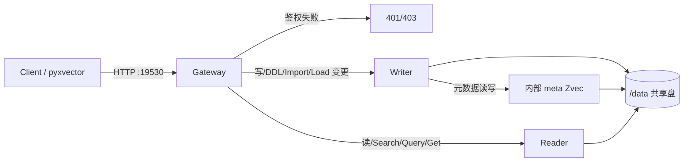

# Xvector 实现设计说明书

> 版本：v1.0（冻结决策落地稿）  
> 引擎：zvec **v0.6.0** · API：FastAPI **0.141.1** · 风格：Milvus REST **v2.4.x** `/v2/vectordb/...`  
> 部署形态：多容器 **Gateway + Writer + Reader**（单写多读）  
> 说明：文中标注「建议默认」的条目为实现细节约定，可在实现阶段微调，但不得违背已冻结产品决策。

---

## 1. 目标与非目标

### 1.1 目标

1. 提供与 **Milvus REST API v2.4.x** 风格对齐的 HTTP 服务（路径前缀 `/v2/vectordb`），覆盖 Alias / Collection / Import / Index / Partition / Role / User / Vector（含 Hybrid Search）全组 API。
2. 底层向量引擎为 **zvec 0.6.0**；对 zvec 不支持的 Milvus 概念在上层 **完整模拟**（元数据 + 路由语义）。
3. 部署为 Docker Compose 三服务：**Gateway（鉴权+路由）/ Writer（独占写）/ Reader（多读）**；共享数据盘；资源总量约 2 CPU / 4GiB。
4. 提供薄客户端包 **pyxvector**（HTTP 封装，贴近 Milvus REST v2）。
5. 以 docker-compose 真集群 E2E（打 Gateway:19530）为测试主路径。

### 1.2 非目标

1. 不实现完整 Milvus 权限强制拦截（Privilege 元数据可 CRUD，**不**拦截业务 API）。
2. 不保证与官方 Milvus 字节级协议兼容（仅 REST v2 JSON 风格与语义近似）。
3. 不支持 gRPC / pymilvus 原生协议；不实现多 Writer 分片、跨节点副本一致性（强一致）。
4. Import 首版仅 **JSON/JSONL**；不支持 parquet/numpy 等其他格式。
5. 不在 macOS/Windows 上保证 DiskANN；以 Linux/Docker 为准。
6. 本阶段不写业务实现代码（本文件为设计契约）。

---

## 2. 决策摘要表

| # | 主题 | 冻结决策 |
|---|------|----------|
| 1 | 缺失概念 | Zvec 不支持的 Milvus 概念 → **上层完整模拟** |
| 2 | 鉴权 | Env 引导初始管理员；User/Role/Privilege 元数据持久化；`Bearer=USERNAME:PASSWORD`；**仅登录鉴权**，Privilege 不强制拦截业务 API |
| 3 | 并发 | 单写多读；**Gateway + Writer + Reader** 多容器 |
| 4 | Partition | **混合**：默认 `_default` 单目录；显式 partition = 独立 Zvec 目录 |
| 5 | Import | 本地挂载路径 + 可选 S3/MinIO；首版仅 JSON/JSONL |
| 6 | PK | 对外 Int64 / VarChar；内部适配为 Zvec 字符串 ID；支持 autoID |
| 7 | 客户端 | pyxvector：薄 HTTP 封装，贴近 Milvus REST v2 |
| 8 | 元数据 | 内部专用 Zvec collection（与业务隔离）；元数据写走 Writer |
| 9 | Env 默认 | 见 §11；`XVECTOR_HTTP_PORT=19530`，`XVECTOR_DATA_DIR=/data` 等 |
| 10 | Load/Release | 默认句柄级强制（未 Load 失败）；`XVECTOR_AUTO_LOAD=true` 可懒加载 |
| 11 | Python | 3.10–3.12；Docker 默认 3.11；DiskANN 以 Linux/Docker 为准 |
| 12 | Database | 完整模拟；目录隔离 `/data/dbs/{dbName}/...` |
| 13 | 读可见性 | 最终一致；默认 N=10s Reader 定时 reopen；env + 请求级覆盖 |
| 14 | 鉴权位置 | 仅 Gateway；Writer/Reader 内网信任（可附 `X-User`） |
| 15 | 密码 | 加盐哈希；引导管理员支持 env 热更新覆盖校验 |
| 16 | 测试 | docker-compose 真集群 E2E 为主 |
| 17 | 技术栈 | zvec 0.6.0 / FastAPI 0.141.1 / Milvus REST v2.4.x 风格 |
| 18 | 索引 | Flat / HNSW / HNSW-RaBitQ / DiskANN / IVF |
| 19 | API 组 | Alias, Collection, Import, Index, Partition, Role, User, Vector 全覆盖 |

---

## 3. 总体架构

### 3.1 组件职责

| 组件 | 职责 | 对外端口 |
|------|------|----------|
| **Gateway** | 鉴权、请求校验、按路由表转发 Writer/Reader；健康检查聚合；附带 `X-User` | **19530**（对外唯一入口） |
| **Writer** | 独占打开业务 Zvec 与内部元数据 collection；处理所有写与 DDL/Import/Load 状态变更；单进程写 | 内网 `18081`（建议默认） |
| **Reader** | 只读打开业务 collection（按 Load 集合）；Search/Query/Get/Hybrid；定时/按需 reopen | 内网 `18082`（建议默认） |

共享卷：`XVECTOR_DATA_DIR`（默认 `/data`）挂载到三容器同一路径。

### 3.2 数据流

```text
Client / pyxvector
        |  HTTP :19530
        v
   +----------+     Bearer USERNAME:PASSWORD
   | Gateway  |---- 鉴权（仅此处）----+
   +----+-----+                       |
        |                             v
        |                    元数据/用户表（内部 Zvec，经 Writer）
        |
   +----+------------------+
   | 路由分流（见 §8）      |
   +----+----------+-------+
        |          |
        | write    | read
        v          v
   +--------+  +--------+
   | Writer |  | Reader |   <--- 共享 /data
   | :18081 |  | :18082 |
   +---+----+  +---+----+
       |           |
       v           v
   zvec open(W)  zvec open(R) + N 秒 reopen
```



### 3.3 进程内边界（建议默认）

- Gateway：**不**直接 `import zvec` 打开业务库，只做 HTTP 代理与鉴权。
- Writer / Reader：各自进程内 `zvec.init(...)` 一次；Writer 持有写句柄；Reader 持有只读句柄字典（按 `db/collection/partition` 键）。
- 内部通信：建议默认 HTTP JSON（uvicorn），header `X-Internal-Token`（compose 内共享密钥，可选）+ `X-User`。

---

## 4. 仓库目录结构（建议树）

```text
Xvector/
├── README.md
├── TODO-List.md
├── LICENSE
├── docs/
│   └── DESIGN.md                 # 本说明书
├── requirements.txt              # 服务端 + 测试依赖
├── requirements-client.txt       # 建议默认：pyxvector 发布用精简依赖
├── Dockerfile                    # 多阶段；同一镜像，CMD 由 ROLE 区分
├── docker-compose.yaml
├── .env.example
├── pyproject.toml                # 建议默认：包元数据（pyxvector）
├── xvector/                      # 服务端包
│   ├── __init__.py
│   ├── __main__.py               # python -m xvector --role gateway|writer|reader
│   ├── config.py                 # 环境变量加载与校验
│   ├── logging.py
│   ├── common/
│   │   ├── errors.py             # Milvus 风格 code/message
│   │   ├── models.py             # Pydantic 请求/响应
│   │   ├── pk.py                 # Int64/VarChar ↔ zvec str id；autoID
│   │   ├── schema_map.py         # Collection/Index ↔ zvec schema
│   │   └── paths.py              # 数据目录路径工具
│   ├── auth/
│   │   ├── password.py           # 加盐哈希 / 校验 / env 热更新
│   │   └── gateway_auth.py
│   ├── meta/
│   │   ├── store.py              # 内部 Zvec collection 访问（仅 Writer 写）
│   │   ├── docs.py               # 元数据 Doc 类型常量与编解码
│   │   └── catalog.py            # db/collection/partition/alias/index/load/job
│   ├── engine/
│   │   ├── zvec_runtime.py       # init / open / close / reopen
│   │   ├── collection_mgr.py     # 业务 collection 句柄（W/R）
│   │   ├── partition_layout.py   # 混合 partition 路径策略
│   │   └── index_map.py          # 五种索引参数映射
│   ├── services/                 # 业务用例（无 FastAPI 依赖）
│   │   ├── alias.py
│   │   ├── collection.py
│   │   ├── import_job.py
│   │   ├── index.py
│   │   ├── partition.py
│   │   ├── role.py
│   │   ├── user.py
│   │   └── vector.py
│   ├── api/                      # FastAPI 路由层
│   │   ├── app_factory.py
│   │   ├── health.py
│   │   ├── gateway_app.py
│   │   ├── writer_app.py
│   │   ├── reader_app.py
│   │   └── v2/
│   │       ├── alias.py
│   │       ├── collection.py
│   │       ├── import_.py
│   │       ├── index.py
│   │       ├── partition.py
│   │       ├── role.py
│   │       ├── user.py
│   │       └── vector.py
│   └── gateway/
│       ├── proxy.py              # 转发 Writer/Reader
│       └── router_table.py       # 路由分流表
├── pyxvector/                    # 客户端包
│   ├── __init__.py
│   ├── client.py                 # XvectorClient
│   ├── http.py                   # 会话 / Bearer / 错误解析
│   ├── exceptions.py
│   └── api/
│       ├── alias.py
│       ├── collection.py
│       ├── import_.py
│       ├── index.py
│       ├── partition.py
│       ├── role.py
│       ├── user.py
│       └── vector.py
├── scripts/
│   ├── wait_ready.sh
│   └── gen_internal_token.sh
└── tests/
    ├── conftest.py               # compose 就绪、客户端 fixture、读等待
    ├── e2e/
    │   ├── test_auth.py
    │   ├── test_user_role.py
    │   ├── test_database_collection.py
    │   ├── test_partition.py
    │   ├── test_index.py
    │   ├── test_vector_dml_search.py
    │   ├── test_hybrid_search.py
    │   ├── test_import.py
    │   ├── test_alias.py
    │   └── test_load_release.py
    └── unit/                     # 建议默认：纯函数单测（pk/schema_map/index_map）
        └── ...
```

---

## 5. 数据目录布局

根目录：`${XVECTOR_DATA_DIR}`（默认 `/data`）。

```text
/data/
├── meta/
│   └── xvector_meta/             # 内部专用 Zvec collection 目录（与业务隔离）
│       └── <zvec files>
├── dbs/
│   └── {dbName}/                 # Database 完整模拟，目录隔离
│       ├── collections/
│       │   └── {collectionName}/
│       │       ├── _default/     # 默认 partition：单目录（混合策略）
│       │       │   └── <zvec collection files>
│       │       └── {partitionName}/   # 显式创建的 partition：独立 Zvec 目录
│       │           └── <zvec collection files>
│       └── imports/              # 建议默认：该 db 下本地 import 暂存/清单
│           └── {jobId}/
│               ├── source.manifest.json
│               └── ...
├── imports/                      # 可选：全局 import 落盘区（挂载宿主机）
│   └── ...
└── tmp/                          # S3 下载暂存等
```

### 5.1 路径规则（建议默认）

| 对象 | 路径 |
|------|------|
| 元数据 Zvec | `/data/meta/xvector_meta` |
| DB | `/data/dbs/{dbName}` |
| 默认 partition | `/data/dbs/{dbName}/collections/{coll}/_default` |
| 显式 partition | `/data/dbs/{dbName}/collections/{coll}/{partitionName}` |
| Import 作业目录 | `/data/dbs/{dbName}/imports/{jobId}` |

### 5.2 命名约束（建议默认）

- `dbName` / `collectionName` / `partitionName`：`^[A-Za-z_][A-Za-z0-9_]{0,254}$`；保留名：`_default`（partition）、`xvector_meta`（禁止作业务名）。
- 默认 DB 名：`default`（与 Milvus 习惯对齐）。

---

## 6. 元数据模型

### 6.1 内部 Collection

- **名称/路径**：`xvector_meta` @ `/data/meta/xvector_meta`
- **访问**：仅 Writer 打开写；Gateway/Reader **不**直接写；Reader 如需读元数据（如 Load 状态、schema），建议默认：
  - **方案 A（推荐）**：Reader 启动时只读打开 meta，并按 `XVECTOR_META_REFRESH_SECONDS`（建议默认=与 Reader 刷新相同 10s）reopen；或
  - **方案 B**：通过内网向 Writer 查询只读元数据 API。
- **主键**：所有元数据 Doc 使用字符串 ID：`{doc_type}:{natural_key}`。
- **建议默认 Schema**：
  - `id`: string（PK）
  - `doc_type`: string（keyword / 可过滤字段）
  - `payload`: string（JSON 文本，完整业务字段）
  - `updated_at`: int64（毫秒）
  - 可选向量字段：不需要（纯标量 meta；若 zvec 强制向量，放 1 维 dummy，建议默认维度=1，值 `[0.0]`）

> 实现时以 zvec 0.6.0 实际 schema 约束为准；若允许无向量 collection，则省略 dummy。

### 6.2 Doc 类型与字段

以下字段均序列化进 `payload`（或拆成独立标量字段——建议默认：核心过滤字段提升为标量，其余进 payload）。

#### 6.2.1 `user`

| 字段 | 类型 | 说明 |
|------|------|------|
| username | str | 唯一 |
| password_salt | str | 随机盐（hex/base64） |
| password_hash | str | 建议默认：`pbkdf2_sha256` 或 `bcrypt` |
| roles | list[str] | 角色名列表 |
| is_bootstrap | bool | 是否为 env 引导管理员映射 |
| created_at / updated_at | int64 | |

引导管理员：启动时若 `XVECTOR_USERNAME`/`XVECTOR_PASSWORD` 存在，则 upsert 对应用户；**每次认证时**若 env 密码与当前请求明文匹配，则视为通过（env 热更新覆盖校验），并可选同步 hash。

#### 6.2.2 `role`

| 字段 | 类型 | 说明 |
|------|------|------|
| role_name | str | 唯一 |
| privileges | list[object] | `{object_type, object_name, privilege}` |
| created_at / updated_at | int64 | |

Privilege **仅存储**，API 可 CRUD；**不**在 Gateway 强制拦截业务 API。

#### 6.2.3 `database`

| 字段 | 类型 | 说明 |
|------|------|------|
| db_name | str | 唯一 |
| created_at | int64 | |

建议默认：启动确保 `default` 存在。

#### 6.2.4 `collection`（catalog）

| 字段 | 类型 | 说明 |
|------|------|------|
| db_name | str | |
| collection_name | str | |
| schema | object | Milvus 风格 fields / functions / enableDynamicField 等 |
| properties | object | 可选 TTL 等（上层模拟） |
| shards_num | int | 上层模拟字段，建议默认=1，不映射 zvec |
| consistency_level | str | 上层模拟，读侧最终一致 |
| auto_id | bool | |
| primary_field | str | |
| primary_type | `Int64` \| `VarChar` | |
| vector_fields | list | 名称/维度/度量类型 |
| created_at / updated_at | int64 | |

#### 6.2.5 `partition`

| 字段 | 类型 | 说明 |
|------|------|------|
| db_name | str | |
| collection_name | str | |
| partition_name | str | `_default` 始终存在于元数据 |
| kind | `default_dir` \| `explicit_dir` | 混合策略标记 |
| created_at | int64 | |

#### 6.2.6 `alias`

| 字段 | 类型 | 说明 |
|------|------|------|
| db_name | str | |
| alias | str | 库内唯一 |
| collection_name | str | 目标集合 |
| updated_at | int64 | |

#### 6.2.7 `index`

| 字段 | 类型 | 说明 |
|------|------|------|
| db_name | str | |
| collection_name | str | |
| field_name | str | |
| index_name | str | |
| index_type | str | FLAT/HNSW/... |
| metric_type | str | L2/IP/COSINE/... |
| params | object | 原始 + 已映射 zvec 参数 |
| state | `InProgress` \| `Finished` \| `Failed` | 建议默认同步建完即 Finished |
| created_at / updated_at | int64 | |

#### 6.2.8 `load_state`

| 字段 | 类型 | 说明 |
|------|------|------|
| db_name | str | |
| collection_name | str | |
| scope | `collection` \| `partition` | |
| partition_names | list[str] | 空表示整库 |
| loaded | bool | |
| replica_number | int | 上层模拟，建议默认=1 |
| updated_at | int64 | |

Writer 在 Load/Release 时更新；Reader 依据此打开/关闭句柄。

#### 6.2.9 `import_job`

| 字段 | 类型 | 说明 |
|------|------|------|
| job_id | str | UUID |
| db_name / collection_name | str | |
| partition_name | str \| null | |
| files | list[str] | 本地路径或 s3 URI |
| format | `json` \| `jsonl` | |
| state | 见 §9.5 | |
| progress | int | 0–100 |
| imported_rows / total_rows | int | |
| error_message | str \| null | |
| created_at / updated_at / finished_at | int64 | |

#### 6.2.10 `privilege_grant`（可选拆分）

若不便嵌在 `role.privileges`，可独立 doc；建议默认嵌在 role 即可。

### 6.3 ID 约定（建议默认）

```text
user:{username}
role:{role_name}
database:{db_name}
collection:{db_name}/{collection_name}
partition:{db_name}/{collection_name}/{partition_name}
alias:{db_name}/{alias}
index:{db_name}/{collection_name}/{index_name}
load:{db_name}/{collection_name}[/{partition_name}]
import:{job_id}
```

---

## 7. 鉴权与安全

### 7.1 Gateway 鉴权

1. 请求头：`Authorization: Bearer ${USERNAME}:${PASSWORD}`（与 TODO / Milvus 兼容写法一致；注意密码中含 `:` 时，建议默认：**仅分割第一个冒号** → `username, password = token.split(":", 1)`）。
2. 校验顺序：
   1. 若 username == `XVECTOR_USERNAME` 且 password == 当前环境 `XVECTOR_PASSWORD` → **通过**（env 热更新覆盖）。
   2. 否则查 meta `user`，用 salt+hash 校验。
3. 失败返回 HTTP 401；响应体建议默认对齐 Milvus：`{"code": 1800, "message": "..."}`（具体 code 以实现时对照表为准）。
4. 健康检查 `/healthz`、`/readyz`：**不**要求鉴权（建议默认）。

### 7.2 Privilege

- Role / User / Grant / Revoke API 完整可调用并持久化。
- **不**根据 Privilege 拒绝 Collection/Vector 等业务 API。

### 7.3 内网信任

- Writer/Reader 不对外暴露；不强制 Bearer。
- Gateway 转发时附加：
  - `X-User: {username}`
  - `X-Request-Id: {uuid}`（建议默认）
  - 可选 `X-Internal-Token: ${XVECTOR_INTERNAL_TOKEN}`

### 7.4 密码存储

- 建议默认：`hash = PBKDF2-HMAC-SHA256(password, salt, iterations=200_000)`，salt 16+ bytes。
- `UpdatePassword`：校验旧密码（引导用户同样允许 env 明文匹配）后写新 hash。
- 禁止日志打印明文密码 / Authorization 头。

### 7.5 传输与其它

- 建议默认：compose 内 HTTP 明文；生产可在前置反代 TLS。
- CORS：建议默认关闭或仅开发开启。

---

## 8. API 路由完整清单

约定：

- 对外前缀：`/v2/vectordb`
- 方法：与 Milvus REST v2 一致，多为 **POST** + JSON body。
- **转发目标**：`W`=Writer，`R`=Reader。
- 响应外壳建议默认：`{"code": 0, "data": ..., "message": "success"}`；错误 `code != 0`。

### 8.1 系统 / 健康

| 路径 | 转发 | 行为摘要 |
|------|------|----------|
| `GET /healthz` | Gateway 本地 | liveness：进程活着即 200 |
| `GET /readyz` | Gateway→探测 W/R | readiness：两侧 `/readyz` 均 OK |
| `GET /v2/vectordb/heartbeat` 或内部等价 | 建议默认 Gateway 本地 | 可选，返回服务版本 |

Writer/Reader 另暴露内网：`GET /healthz`、`GET /readyz`（检查 zvec init、meta 可打开、数据盘可写/可读）。

### 8.2 Database（完整模拟；若 v2.4 路径存在则对齐）

> Milvus REST 部分版本 Database 在 `/v2/vectordb/databases/...`。建议默认实现下列接口（客户端/测试使用）。

| 路径 | 转发 | 行为 |
|------|------|------|
| `/v2/vectordb/databases/create` | W | 建目录 + meta |
| `/v2/vectordb/databases/drop` | W | 拒删非空（建议默认）；删目录 + meta |
| `/v2/vectordb/databases/list` | R 或 W | 建议默认 **R**（读 meta 刷新） |
| `/v2/vectordb/databases/describe` | R | 返回属性 |

### 8.3 Alias

| 路径 | 转发 | 行为 |
|------|------|------|
| `/v2/vectordb/aliases/create` | W | 绑定 alias→collection |
| `/v2/vectordb/aliases/drop` | W | 删除 alias |
| `/v2/vectordb/aliases/alter` | W | 改绑定目标 |
| `/v2/vectordb/aliases/describe` | R | 查 alias |
| `/v2/vectordb/aliases/list` | R | 列表 |

### 8.4 Collection

| 路径 | 转发 | 行为 |
|------|------|------|
| `/v2/vectordb/collections/create` | W | 写 meta + 创建 `_default` zvec 目录/schema |
| `/v2/vectordb/collections/drop` | W | 关闭句柄、删目录与相关 meta/index/alias/load |
| `/v2/vectordb/collections/describe` | R | schema + 索引摘要 |
| `/v2/vectordb/collections/has` | R | 是否存在 |
| `/v2/vectordb/collections/list` | R | 按 db 列表 |
| `/v2/vectordb/collections/rename` | W | 改名（目录 rename + meta） |
| `/v2/vectordb/collections/load` | W | 更新 load_state；通知 Reader 打开（见 §10） |
| `/v2/vectordb/collections/release` | W | 更新 load_state；通知 Reader 关闭 |
| `/v2/vectordb/collections/get_load_state` | R | 读 load_state |
| `/v2/vectordb/collections/get_stats` | R | row_count 等（聚合各 partition） |

### 8.5 Partition

| 路径 | 转发 | 行为 |
|------|------|------|
| `/v2/vectordb/partitions/create` | W | 显式目录 + meta；复制 schema/index 配置到新 zvec |
| `/v2/vectordb/partitions/drop` | W | 禁止 drop `_default`（建议默认）；删目录 |
| `/v2/vectordb/partitions/has` | R | |
| `/v2/vectordb/partitions/list` | R | |
| `/v2/vectordb/partitions/get_stats` | R | |
| `/v2/vectordb/partitions/load` | W | 分区级 load_state |
| `/v2/vectordb/partitions/release` | W | |

### 8.6 Index

| 路径 | 转发 | 行为 |
|------|------|------|
| `/v2/vectordb/indexes/create` | W | 映射 zvec 索引并应用；写 meta |
| `/v2/vectordb/indexes/describe` | R | |
| `/v2/vectordb/indexes/drop` | W | 删索引（zvec 能力不足则上层标记 + 重建策略，见 §16） |
| `/v2/vectordb/indexes/list` | R | （TODO 中的 Listes → `list`） |

### 8.7 Import

| 路径 | 转发 | 行为 |
|------|------|------|
| `/v2/vectordb/jobs/import/create` | W | 创建 job，异步导入 |
| `/v2/vectordb/jobs/import/get_progress` | W 或 R | 建议默认 **W**（状态权威） |
| `/v2/vectordb/jobs/import/list` | W | 列表 |

> 路径以 Milvus v2.4 Import 文档为准；若官方为 `/v2/vectordb/import/...`，实现时与文档对齐，pyxvector 同步。

### 8.8 Role

| 路径 | 转发 | 行为 |
|------|------|------|
| `/v2/vectordb/roles/create` | W | |
| `/v2/vectordb/roles/drop` | W | |
| `/v2/vectordb/roles/describe` | W 或 R | 建议默认 **W**（与用户同权威源） |
| `/v2/vectordb/roles/list` | W | （Lists → list） |
| `/v2/vectordb/roles/grant_privilege` | W | 仅持久化 |
| `/v2/vectordb/roles/revoke_privilege` | W | 仅持久化 |

### 8.9 User

| 路径 | 转发 | 行为 |
|------|------|------|
| `/v2/vectordb/users/create` | W | hash 存盘 |
| `/v2/vectordb/users/drop` | W | 禁止删除引导用户名（建议默认） |
| `/v2/vectordb/users/describe` | W | 不含密码 hash |
| `/v2/vectordb/users/list` | W | |
| `/v2/vectordb/users/update_password` | W | |
| `/v2/vectordb/users/grant_role` | W | |
| `/v2/vectordb/users/revoke_role` | W | |

### 8.10 Vector

| 路径 | 转发 | 行为 |
|------|------|------|
| `/v2/vectordb/entities/insert` | W | PK 适配 + insert |
| `/v2/vectordb/entities/upsert` | W | |
| `/v2/vectordb/entities/delete` | W | 按 filter / ids |
| `/v2/vectordb/entities/get` | R | 按 ids 取实体 |
| `/v2/vectordb/entities/query` | R | 标量过滤查询 |
| `/v2/vectordb/entities/search` | R | 向量检索 |
| `/v2/vectordb/entities/hybrid_search` | R | 多向量/混合检索 |

> 实际路径名以 Milvus REST v2.4 Vector 章节为准（部分文档使用 `/v2/vectordb/entities/...`）。实现与 pyxvector 必须一致。

### 8.11 分流总表（速查）

| 类别 | Writer | Reader |
|------|--------|--------|
| 鉴权相关 User/Role 写读权威 | ✅ | — |
| DDL：DB/Collection/Partition/Index/Alias | ✅ | describe/list/has/stats |
| Load/Release / Import | ✅ | get_load_state |
| DML：insert/upsert/delete | ✅ | — |
| Search/Query/Get/Hybrid | — | ✅ |

---

## 9. 核心语义适配

### 9.1 Collection / Index ↔ zvec 映射

#### 9.1.1 Collection

| Milvus 概念 | Xvector / zvec 映射 |
|-------------|---------------------|
| Database | 目录 `/data/dbs/{db}` + meta |
| Collection | 每 partition 一个 zvec collection 目录；schema 同源 |
| Field schema | 映射为 `zvec.CollectionSchema` 的标量/向量字段 |
| Primary Key Int64 | 对外 int；内部 `str(id)`；autoID 用雪花/雪花简化版或 `uuid` 再解析回 int（建议默认：**雪花 int64** → str） |
| Primary Key VarChar | 直接作为 zvec `Doc.id` |
| Dynamic field | 上层模拟：未声明字段进 JSON 标量 `$_dynamic`（建议默认字段名）或拒绝（若关闭） |
| shards_num / replica | 仅 meta 存储 |

创建流程（Writer）：

1. 校验 schema（必须有且仅一个 PK；至少一个向量字段——建议默认）。
2. 写 `collection` + `partition(_default)` meta。
3. `zvec.create_and_open(path=_default, schema=...)` 后关闭或按需保持。
4. 若请求带 index 参数，走 Index Create。

#### 9.1.2 五种索引参数映射表

| Milvus `index_type` | zvec 对应（建议默认） | 关键参数映射 | 备注 |
|---------------------|----------------------|--------------|------|
| `FLAT` / `FLAT` | Flat / brute-force | `metric_type` → zvec metric | 暴力检索 |
| `HNSW` | HNSW | `M` → `M`；`efConstruction` → `ef_construction`；搜索 `ef` → query `ef` | |
| `HNSW_RABITQ` / `HNSW-RaBitQ` | HNSW-RaBitQ | 同上 + 量化相关（`refine`/`bits` 等以 zvec 0.6 API 名为准） | 别名归一 |
| `DISKANN` | DiskANN | `search_list` 等 → zvec DiskANN 参数 | **仅 Linux/Docker 保证**；非 Linux 创建可返回错误或测试 skip |
| `IVF_FLAT` / `IVF_SQ8` / `IVF_PQ` | IVF 族 | `nlist` → `nlist`；搜索 `nprobe` → `nprobe` | 具体量化子类型按 zvec 支持集映射；不支持的子类型明确报错 |

**度量类型映射（建议默认）**

| Milvus `metric_type` | zvec |
|----------------------|------|
| `L2` | L2 |
| `IP` | IP / InnerProduct |
| `COSINE` | COSINE |

索引创建时机：建议默认 **CreateIndex 时同步应用到各已存在 partition 目录**；之后新建 partition 时继承 collection 级 index 定义并创建。

### 9.2 Partition 混合策略细节

| 场景 | 行为 |
|------|------|
| Collection Create | 自动创建逻辑+物理 `_default` 单目录 |
| Partition Create(`name`) | `name != _default`；新建独立 zvec 目录；schema/index 与 collection 对齐 |
| Insert 未指定 partition | 写入 `_default` |
| Insert 指定 partition | 写入对应目录 |
| Search/Query 指定 partitions 列表 | Reader 对多个目录分别查再合并 TopK（建议默认） |
| Drop `_default` | 拒绝 |
| Drop collection | 删除所有 partition 目录 |

跨 partition 的 ID 唯一性：建议默认 **collection 级唯一**（插入前不强制全局扫描；文档告知与 Milvus 可能差异）；删除/Get 按指定 partitions 或全部扫描。

### 9.3 Load / Release + AUTO_LOAD

| 配置 | 行为 |
|------|------|
| 默认 `XVECTOR_AUTO_LOAD=false` | Search/Query/Get/Hybrid 前检查 `load_state.loaded`；未 Load → 失败（建议 code 与 Milvus “collection not loaded” 对齐） |
| `XVECTOR_AUTO_LOAD=true` | 未 Load 时 Reader **懒打开**句柄并服务；不强制改写 meta.loaded（建议默认：不改 meta，仅进程内懒加载） |
| `Load` | Writer 更新 meta；向 Reader 发 `POST /internal/reload`（或 Reader 下次刷新时打开） |
| `Release` | Writer 更新 meta；Reader 关闭句柄 |
| Partition Load/Release | 粒度到 partition 目录句柄 |

句柄缓存键：`{db}/{collection}/{partition}`。

### 9.4 Vector DML / Search / Query / Hybrid 字段映射

| Milvus 侧 | 内部 / 响应 |
|-----------|-------------|
| 实体 `id` / PK 字段 | zvec `Doc.id`（字符串）；响应按 schema 还原 Int64 或 VarChar |
| 向量字段 | `Doc.vectors[{field}]` |
| 标量字段 | `Doc` 标量 / payload |
| Search 返回 `distance` / `score` | zvec 返回 `score`；按 metric 约定输出：建议默认 **同时提供** `score` 与 `distance`（L2：`distance=score`；IP/COSINE：文档注明 score 语义，`distance` 按需转换或原样） |
| `output_fields` | 从 Doc 投影 |
| `filter` 表达式 | 翻译为 zvec filter（支持子集；不支持的算子明确报错） |
| Hybrid Search | 多 `search` 请求 + rerank（`RRF`/`Weighted`）；zvec 原生 hybrid/多向量能力优先，不足则上层融合 |

**autoID**：`insert` 时若缺 PK 且 `auto_id=true`，Writer 生成 ID；响应 `insertIds`。

**upsert**：存在则覆盖向量与标量（zvec 无原生 upsert 时 = delete+insert 或覆盖写 API）。

### 9.5 Import 任务状态机

```text
Pending → Downloading → Parsing → Importing → Completed
                              ↘         ↘
                               Failed ←←←
任意非终态可 → Cancelled（建议默认支持 cancel；首版可暂不暴露 API）
```

| 状态 | 含义 |
|------|------|
| `Pending` | 已创建 job |
| `Downloading` | 从 S3/MinIO 拉取到本地（本地路径则跳过） |
| `Parsing` | 解析 JSON/JSONL，统计 total_rows |
| `Importing` | 批量 insert（建议默认 batch=500） |
| `Completed` | progress=100 |
| `Failed` | 写 `error_message` |
| `Cancelled` | 可选 |

**数据源**：

- 本地：容器内可见路径（挂载 `/data` 或额外 import volume）。
- S3：`s3://bucket/key`，凭据见 `XVECTOR_S3_*`。

**格式**：

- JSON：数组 `[ {...}, ... ]` 或 `{"rows":[...]}`（建议默认两种都接受）。
- JSONL：每行一个对象。

---

## 10. 单写多读与刷新协议

### 10.1 原则

- 同一 zvec collection 目录：**仅 Writer 进程写**；Reader **只读打开**。
- 读侧可见性：**最终一致**。

### 10.2 定时 reopen

- 环境变量：`XVECTOR_READER_REFRESH_SECONDS`（**默认 10**）。
- Reader 后台任务：每 N 秒对已 Load 句柄执行 close+open（或 zvec 提供的刷新 API，若有）。

### 10.3 请求级覆盖（建议默认键名）

优先级从高到低：

1. Header：`X-XVector-Refresh: true|false` 或 `X-XVector-Refresh-Seconds: <int>`
2. Query：`refresh=true` / `refresh_seconds=<int>`
3. Body 字段（若存在）：`refresh` / `refreshSeconds`
4. 环境变量默认 N

行为：

- `refresh=true`：本次读前对涉及 collection/partition **立即 reopen**。
- `refresh_seconds=0`：同立即刷新。
- 仅影响当前请求，不修改全局 N。

### 10.4 Load 通知（建议默认）

1. Writer Load 成功后 `POST http://reader:18082/internal/open`（body: db/collection/partitions）。
2. 失败则依赖 Reader 定时刷新 meta + 打开（最坏延迟 ≈ N 秒）。

### 10.5 写后读测试策略

E2E 在 insert 后：等待 `max(N, refresh)` 或带 `X-XVector-Refresh: true` 再 search（见 §14）。

---

## 11. Docker / compose / 健康检查 / 资源限制

### 11.1 环境变量

| 变量 | 默认 | 说明 |
|------|------|------|
| `XVECTOR_USERNAME` | （必填建议） | 引导管理员 |
| `XVECTOR_PASSWORD` | （必填建议） | 引导管理员密码；支持热更新覆盖校验 |
| `XVECTOR_DATA_DIR` | `/data` | 共享数据根 |
| `XVECTOR_HTTP_PORT` | `19530` | Gateway 对外端口 |
| `XVECTOR_WRITER_URL` | `http://writer:18081` | Gateway 用 |
| `XVECTOR_READER_URL` | `http://reader:18082` | Gateway 用 |
| `XVECTOR_WRITER_PORT` | `18081` | |
| `XVECTOR_READER_PORT` | `18082` | |
| `XVECTOR_ROLE` | — | `gateway` \| `writer` \| `reader` |
| `XVECTOR_AUTO_LOAD` | `false` | 懒加载开关 |
| `XVECTOR_READER_REFRESH_SECONDS` | `10` | 读刷新周期 |
| `XVECTOR_META_REFRESH_SECONDS` | `10` | 建议默认 |
| `XVECTOR_INTERNAL_TOKEN` | 空 | 可选内网令牌 |
| `XVECTOR_LOG_LEVEL` | `INFO` | |
| `XVECTOR_S3_ENDPOINT` | 空 | 可选 |
| `XVECTOR_S3_ACCESS_KEY` | 空 | |
| `XVECTOR_S3_SECRET_KEY` | 空 | |
| `XVECTOR_S3_BUCKET` | 空 | |
| `XVECTOR_S3_REGION` | 空 | |
| `XVECTOR_S3_SECURE` | `false` | |
| `XVECTOR_PASSWORD_ITERATIONS` | `200000` | PBKDF2 迭代 |

### 11.2 镜像与启动

- 单一 Dockerfile，Python **3.11**，安装 `requirements.txt` + zvec 0.6.0。
- 入口：`python -m xvector` 读取 `XVECTOR_ROLE`。
- 基础镜像建议默认：`python:3.11-slim-bookworm`（Linux，便于 DiskANN）。

### 11.3 compose 拓扑（建议默认）

```yaml
# 逻辑结构（实现时落盘 docker-compose.yaml）
services:
  gateway:
    cpus: "0.25"
    mem_limit: 256m
    ports: ["19530:19530"]
    environment:
      XVECTOR_ROLE: gateway
    volumes: ["xvector-data:/data"]
    depends_on: [writer, reader]
    healthcheck:
      test: ["CMD", "curl", "-f", "http://localhost:19530/healthz"]
      interval: 10s
      timeout: 3s
      retries: 6

  writer:
    cpus: "1.0"
    mem_limit: 2g
    environment:
      XVECTOR_ROLE: writer
    volumes: ["xvector-data:/data"]
    healthcheck: ... /healthz on 18081

  reader:
    cpus: "0.75"
    mem_limit: 1536m   # 1.5g
    environment:
      XVECTOR_ROLE: reader
      XVECTOR_READER_REFRESH_SECONDS: "10"
    volumes: ["xvector-data:/data"]
    healthcheck: ... /healthz on 18082

volumes:
  xvector-data:
```

资源合计：≈ **2.0 CPU / 4.0 GiB**（256M+2G+1.5G）。

### 11.4 健康检查语义

| 端点 | 含义 |
|------|------|
| `/healthz` | 进程存活 |
| `/readyz` | Gateway：W+R ready；Writer：data dir 可写 + meta 可打开；Reader：data dir 可读 + zvec init 完成 |

---

## 12. pyxvector 包设计

### 12.1 定位

薄 HTTP 封装，贴近 Milvus REST v2；不绑定 zvec。

### 12.2 模块

见 §4 `pyxvector/` 树。

### 12.3 主要类 / 方法（建议默认）

```text
XvectorClient(uri="http://localhost:19530", token="user:pass", timeout=60)
  .close()
  .using_database(db_name) -> Self

  # User / Role
  .create_user / .drop_user / .list_users / .describe_user
  .update_password / .grant_role / .revoke_role
  .create_role / .drop_role / .list_roles / .describe_role
  .grant_privilege / .revoke_privilege

  # Collection / Partition / Index / Alias
  .create_collection / .drop_collection / .describe_collection / .has_collection
  .list_collections / .rename_collection
  .load_collection / .release_collection / .get_load_state / .get_collection_stats
  .create_partition / .drop_partition / .has_partition / .list_partitions
  .load_partitions / .release_partitions / .get_partition_stats
  .create_index / .describe_index / .drop_index / .list_indexes
  .create_alias / .drop_alias / .alter_alias / .describe_alias / .list_aliases

  # Vector
  .insert / .upsert / .delete / .get / .query / .search / .hybrid_search

  # Import
  .create_import_job / .get_import_progress / .list_import_jobs

  # Database
  .create_database / .drop_database / .list_databases / .describe_database
```

内部：`HttpClient.request(method, path, json=body)` 自动加 `Authorization: Bearer {token}`；解析 `code!=0` 为 `XvectorApiError`。

可选便捷：`wait_loaded(...)`、`wait_import_complete(...)`、`search_after_write(..., refresh=True)`。

---

## 13. requirements 依赖清单建议

### 13.1 服务端 `requirements.txt`（版本意向）

```text
fastapi==0.141.1
uvicorn[standard]>=0.30,<1
pydantic>=2.7,<3
httpx>=0.27,<1              # Gateway 转发 + 测试
zvec==0.6.0
python-multipart>=0.0.9     # 如需要
orjson>=3.10                # 建议默认高性能 JSON
boto3>=1.34,<2              # 可选 S3；建议默认纳入以便 Import
passlib[bcrypt]>=1.7        # 或纯标准库 hashlib.pbkdf2
# 若用 bcrypt：bcrypt>=4.0
pytest>=8.0,<9
pytest-timeout>=2.3
```

### 13.2 客户端 `requirements-client.txt`（建议默认）

```text
httpx>=0.27,<1
```

### 13.3 Python 版本

- 支持：3.10–3.12  
- Docker：3.11  

---

## 14. pytest E2E 计划

### 14.1 前置

- `docker compose up -d --build`，等待 Gateway `/readyz`。
- Fixture 提供 `XvectorClient(uri="http://127.0.0.1:19530", token=f"{user}:{password}")`。
- 每个模块使用独立 `collection` 名（uuid 后缀），测试结束 drop。

### 14.2 用例分组

| 组 | 文件 | 覆盖点 |
|----|------|--------|
| Auth | `test_auth.py` | 无 token/错密 → 401；正确 Bearer；env 热更新覆盖（可选） |
| User/Role | `test_user_role.py` | CRUD user/role、grant/revoke；确认无 privilege 时业务 API 仍可调用 |
| DB/Collection | `test_database_collection.py` | 多 db 隔离、create/describe/list/has/rename/drop/stats |
| Partition | `test_partition.py` | `_default` + 显式 partition 目录行为、drop 保护 |
| Index | `test_index.py` | Flat/HNSW/HNSW-RaBitQ/IVF 创建与 list/describe；DiskANN 条件执行 |
| Load | `test_load_release.py` | 未 load 失败；load 后可搜；release 后失败；`AUTO_LOAD` 场景（可选 compose override） |
| Vector | `test_vector_dml_search.py` | insert/upsert/delete/get/query/search；Int64+VarChar PK；autoID |
| Hybrid | `test_hybrid_search.py` | 多向量 hybrid + rerank |
| Import | `test_import.py` | 本地 JSON/JSONL；进度到 Completed（S3 可用 MinIO profile 可选） |
| Alias | `test_alias.py` | create/alter/list/describe/drop，经 alias 写入/搜索 |

### 14.3 DiskANN skip 规则

```python
import sys, pytest

requires_diskann = pytest.mark.skipif(
    sys.platform != "linux",
    reason="DiskANN verified on Linux/Docker only",
)
```

在 Linux CI/compose 中执行 DiskANN 用例；macOS 本地 skip。

### 14.4 写后读等待（N=10）

建议默认 fixture：

```python
def wait_visible(client, seconds=None, refresh_header=True):
    # 优先：下一读请求带 X-XVector-Refresh: true（快）
    # 或 time.sleep(XVECTOR_READER_REFRESH_SECONDS + 1)
```

E2E 默认使用 **Refresh Header** 减少套件时长；另保留 1 个用例验证「不带 refresh 时 ≤ N+ε 可见」。

### 14.5 运行方式（建议默认）

```bash
docker compose up -d --build
pytest tests/e2e -v --timeout=120
```

---

## 15. 实现里程碑

| 阶段 | 交付 | 出口标准 |
|------|------|----------|
| **M0** | 仓库骨架：目录、Dockerfile、compose、config/env、健康检查三服务打通 | `compose up` 后 Gateway/W/R `/healthz` 绿 |
| **M1** | 内部 meta collection + User 鉴权（Gateway）+ 引导管理员 | E2E `test_auth` 通过 |
| **M2** | Database + Collection DDL + `_default` zvec 创建/drop/describe/list | catalog E2E 通过 |
| **M3** | Partition 混合策略 + Load/Release + AUTO_LOAD | load E2E 通过 |
| **M4** | Index 五种映射（DiskANN 条件） | index E2E 通过 |
| **M5** | Vector DML + Search/Query/Get + PK/autoID | vector E2E 通过 |
| **M6** | Hybrid Search | hybrid E2E 通过 |
| **M7** | Import JSON/JSONL + 状态机（+ 可选 S3） | import E2E 通过 |
| **M8** | Alias + Role/Privilege CRUD（不拦截） | alias + user_role E2E 通过 |
| **M9** | pyxvector 包 API 对齐 + README 使用说明 | 客户端可跑通主流程 |
| **M10** | 刷新协议（N/env/Header）硬化 + 差异文档 + 回归全绿 | 全量 E2E 稳定 |

并行建议：M1 起即可并行起草 pyxvector 方法签名（可先 mock）。

---

## 16. 风险与已知与 Milvus 的差异清单

| # | 项目 | 差异 / 风险 | 缓解 |
|---|------|-------------|------|
| 1 | 一致性 | 读最终一致（默认最多约 10s），非 Milvus Session/Strong | Header 强制 refresh；文档说明 |
| 2 | Privilege | 仅存储不强制 | 产品已冻结；文档醒目提示 |
| 3 | shards / replica | 仅元数据模拟 | 返回固定值 |
| 4 | 跨 partition PK | 未必强约束全局唯一 | 文档说明；可选后续扫描校验 |
| 5 | filter 表达式 | 未必 100% 兼容 Milvus expr | 支持子集表；不支持则明确错误 |
| 6 | distance 语义 | zvec score 与 Milvus distance 不完全同构 | 映射表 + 双字段返回 |
| 7 | Index drop/alter | zvec 能力可能弱于 Milvus | 上层标记删除或重建目录（高成本，慎用） |
| 8 | DiskANN | 非 Linux 可能不可用 | skip / 创建时报错 |
| 9 | Dynamic field / JSON | 模拟精度有限 | 建议默认有限支持 |
| 10 | Import 格式 | 仅 JSON/JSONL | 明确 501/参数错误 |
| 11 | 单 Writer 瓶颈 | 写吞吐受单进程限制 | 资源倾斜 Writer 1C/2G |
| 12 | rename/drop 并发 | 读句柄与目录删除竞态 | Writer 串行 DDL 锁（建议默认 asyncio.Lock 按 collection） |
| 13 | 元数据 dummy 向量 | 若 zvec 强制向量字段 | 固定 1 维占位 |
| 14 | 密码 Bearer 冒号 | 密码含 `:` | `split(":", 1)` |
| 15 | Hybrid rerank | 与 Milvus RRF 数值可能不完全一致 | 文档差异；测相对序 |
| 16 | 多 Reader 扩展 | 首版单 Reader 容器 | compose 可扩 replicas（只读）；注意连接数与内存 |

---

## 附录 A. 内部接口（建议默认）

| 方法 | 路径 | 说明 |
|------|------|------|
| POST | `/internal/open` | Reader：打开指定 collection/partitions |
| POST | `/internal/close` | Reader：关闭句柄 |
| POST | `/internal/reload` | Reader：刷新 meta + 句柄 |
| GET | `/readyz` | 各角色就绪 |

仅集群网络可达；Gateway 不对外暴露 `/internal/*`。

## 附录 B. 错误码（建议默认起点）

| code | 含义 |
|------|------|
| 0 | 成功 |
| 100 | 参数错误 |
| 1001 | collection 不存在 |
| 1200 | collection 未 load |
| 1800 | 未授权 / 鉴权失败 |
| 2000 | 内部错误 |
| 2100 | 索引类型不支持 |
| 2200 | Import 失败 |

实现阶段对照 Milvus REST 常用 code 做一张完整映射表，保持客户端可判断。

## 附录 C. 实现检查清单（摘要）

- [ ] 三服务 compose + 资源限制 + 共享卷  
- [ ] Gateway 鉴权 + 路由表完整  
- [ ] 内部 meta 与业务目录隔离  
- [ ] Partition 混合策略  
- [ ] 五种索引映射  
- [ ] Load/Release + AUTO_LOAD  
- [ ] 读刷新 N/env/Header  
- [ ] Import 状态机 JSON/JSONL  
- [ ] pyxvector 薄客户端  
- [ ] E2E 真集群全绿（DiskANN 条件）  

---

*本说明书为实现契约；业务代码按 §15 里程碑推进，变更冻结决策需先修订本文档。*
